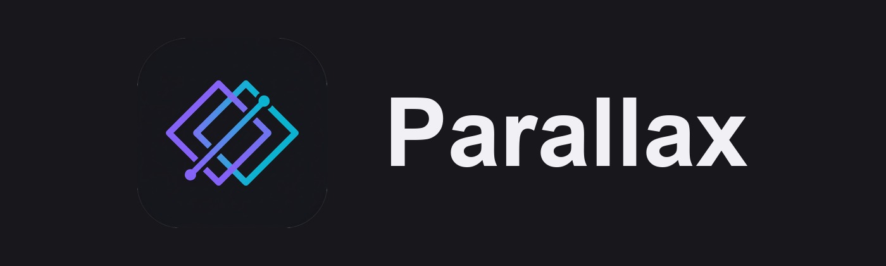

<p align="center">
  
</p>

# Parallax

**Network diagnostics from every vantage point.**

A self-hosted **network looking glass** for comparing connectivity across servers,
regions and providers. Run ping, traceroute, MTR, DNS, TLS and bandwidth tests from
remote agents, with live results in one browser dashboard.

[](https://github.com/EMOEMOJAI/Parallax/actions/workflows/ci.yml)
[](LICENSE)

[Get started](docs/getting-started.md) · [Deploy](docs/deployment.md) · [Reference](docs/reference.md) · [Contribute](CONTRIBUTING.md)

## One dashboard, many perspectives

| Diagnose | Keep watching | Share and explore |
|---|---|---|
| Compare probes across nodes | Schedule recurring checks | Share saved runs with a link |
| Trace routes on a map | Measure node-to-node latency | Reuse diagnostic kits |
| Check DNS, TCP and TLS | Export Prometheus metrics | Offer a restricted public looking glass |
| Test network throughput | Send webhook alerts | Open an interactive node terminal |

**12 probe types.** `ping` · `traceroute` · `mtr` · `nexttrace` · `iperf3` ·
`speedtest` · `dns` · `http` · `tcp` · `tls` · `dnsbench` · `download`.
The last four run natively in Go; other probes use installed tools, whose
availability each agent reports to the dashboard.

## Try it locally

With Docker and Docker Compose installed:

```sh
git clone https://github.com/EMOEMOJAI/Parallax.git
cd Parallax
docker compose up --build
```

Open **http://localhost:8080**. Compose starts the server and one example agent.
For a Go/Node development setup, follow [Getting started](docs/getting-started.md).

```text
Browser  ← WebSocket →  Go server  ← WebSocket →  Agents at each location
```

Before exposing an installation, configure client and agent keys and allowed
origins in the [deployment guide](docs/deployment.md). Interactive shells are
enabled by default; agents can disable them with `-allow-shell=false`.

## Go deeper

- [Configuration and API](docs/reference.md) — probe support, flags, environment variables and authentication.
- [Architecture](docs/architecture.md) — Go server and agents, React UI, protocol and compatibility rules.
- [Contributing](CONTRIBUTING.md) — local checks and useful issue reports.
- [AI and developer tools](AGENTS.md) — shared coding instructions; [llms.txt](llms.txt) indexes the documentation.
- [Brand assets](docs/brand/README.md) — logos, icons and social images.

MIT licensed. See [LICENSE](LICENSE).
